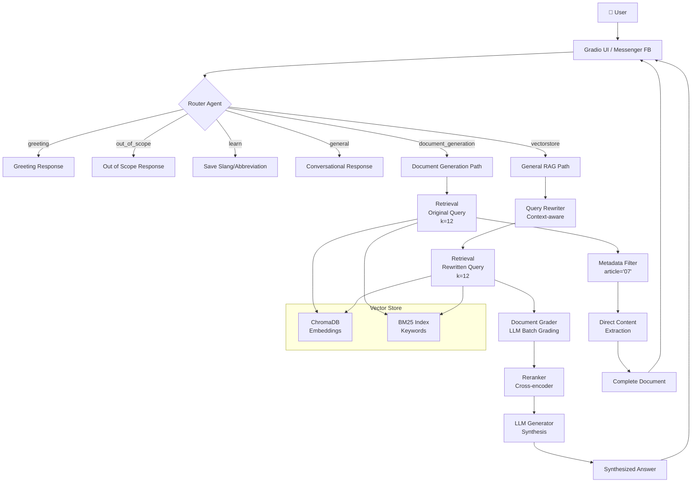

# Agentic RAG Chatbot - HaUI Smart Assistant

An intelligent chatbot system utilizing **Agentic RAG** (Retrieval-Augmented Generation) to answer queries regarding training regulations at Hanoi University of Industry (HaUI).

## 🎯 Overview

### **Key Features:**
- ✅ **Agentic RAG**: Automatically routes queries, rewrites questions, grades documents, and reranks results.
- ✅ **Semantic Chunking**: Splits documents by Article and Appendix to preserve complete context.
- ✅ **Hybrid Search**: Combines Vector Search (50%) + BM25 (50%).
- ✅ **Metadata Filtering**: Exact filtering by article number or via hardcoded intent injection.
- ✅ **Multi-Model Support**: Gemini, OpenAI, Groq, OpenRouter, and Ollama (local).
- ✅ **Auto-Update**: Automatically detects & indexes new documents using an MD5 hash tracker.
- ✅ **Deployment**: Friendly Gradio web interface and a FastAPI backend supporting Facebook Messenger webhooks.

### **Use Cases:**
- 📚 Look up university training regulations and policies.
- 📋 Extract full appendices and administrative forms (complete extraction, no summarization).
- 💬 Q&A regarding graduation requirements, courses, and final projects.
- 🔍 Search for information across multiple documents simultaneously.
- 🤖 Learn student slang and save custom abbreviations dynamically from the chat context.

---

## 🏗️ High-Level Architecture



---

## 📊 System Components

### **1. Core Agents** (`src/agents/`)

#### **Router** (`router.py`)
- **Function**: Classifies the query into 1 of 6 specific routes.
- **Routes**:
  - `greeting`: Simple greetings and small talk.
  - `out_of_scope`: Queries unrelated to HaUI student life.
  - `learn`: Learn and memorize new custom abbreviations from the context.
  - `general`: General conversation or chat history queries.
  - `document_generation`: Requests to output specific appendices or forms.
  - `vectorstore`: Standard RAG for all regulations and policies.

#### **Rewriter** (`rewriter.py`)
- **Function**: Optimizes the query, decomposes complex questions, and adds chat history context.
- **Example**: "What is it?" → "What are the requirements for graduation?"
- **Usage**: General queries (bypassed for document generation queries).

#### **Grader** (`grader.py`)
- **Function**: Evaluates the relevance of each retrieved document.
- **Feature**: Utilizes Batch LLM Grading to save tokens and speed up API calls.
- **Output**: Indices of relevant documents or falls back to the top 1 result.
- **Skip**: Skipped for document generation queries (handled by metadata filtering).

#### **Reranker** (`reranker.py`)
- **Function**: Re-sorts documents based on high-precision rules defined by an expert prompt.
- **Model**: LLM-based zero-shot ranking.
- **Skip**: Skipped if the Grader warns of low general relevance.

#### **Generator** (`generator.py`)
- **Function**: Synthesizes the final answer using retrieved contexts aligned with HaUI's rules.
- **RAG Security**: Strict prompt engineering for timetable scheduling and hallucination prevention.

---

### **2. Chunking Strategy** (`src/legal_chunker.py`)

**Semantic Chunking by Article/Appendix:**

The system utilizes complex regex patterns to accurately identify "Article" (Điều) or "Appendix" (Phụ lục):
```python
pattern = r'^(?:#{1,3}\s+)?(?:\*\*)?(?:Điều|Phụ lục|Slide)\s+(\d+)'
```

**Chunk Structure:**
```python
Document(
    page_content="## **Phụ lục 07 – Biên bản...**\n...",
    metadata={
        'chunk_type': 'article',
        'article': '07',  # For filtering
        'chapter': 'Chương II: ...',
        'complete': True,
        'source': 'qd-1532-24-9-25.md'
    }
)
```

---

### **3. Retrieval** (`src/vector_store.py`)

**Hybrid Search:**
```python
# 50% Vector (semantic) + 50% BM25 (keyword)
results = ensemble_retriever.invoke(query, k=12)
```

**Adaptive Control:**
- Uses a default configuration (`RETRIEVAL_K = 12`) for the entire pipeline.
- Integrates hardcoded Intent Injections to bootstrap critical resources (like scholarships and location/department info) directly to the top.

---

### **4. Workflow** (`src/workflow.py`)

**Procedural Agentic Workflow:**

Unlike generic projects utilizing overhead frameworks like LangGraph, this system is engineered 100% procedurally in pure Python using deterministic `if/elif` logic. This ensures a fast, decoupled, and highly controlled Agent execution flow:

```python
def run(self, question: str, session_id: str = None, chat_history: list = None):
    # 1. Query Routing
    route = self.router.route(question, history)
    
    # Non-RAG fast paths (Latency Optimization)
    if route == "greeting": return [...]
    elif route == "out_of_scope": return [...]
    elif route == "learn": return [...]
    elif route == "general": return [...]
    
    # 2. Document Retrieval
    documents = self.retrieve(state)
    
    # 3. Grading & Reranking (Skipped entirely to save LLM overhead for direct forms)
    if not is_document_query:
        documents = self.grade_documents(state)
        documents = self.rerank_documents(state)
        
    # 4. Generation & Auto-Retry
    while retry_count <= MAX_RETRIES:
        answer = self.generate_answer(state)
        if ENABLE_HALLUCINATION_CHECK and self.check_hallucination(answer):
            break
```

---

## 📁 Project Structure

```
agentic_chatbot/
├── src/
│   ├── agents/           # Intelligent Agent components
│   │   ├── router.py          # Query router
│   │   ├── rewriter.py        # Query rewriter
│   │   ├── grader.py          # Document grader
│   │   ├── reranker.py        # Document reranker
│   │   ├── generator.py       # General answer generator
│   │   ├── document_generator.py # Form/Appendix exact extractor
│   │   └── hallucination_check.py # LLM hallucination validator
│   ├── workflow.py       # Procedural manual workflow logic
│   ├── vector_store.py   # Hybrid retrieval manager (Chroma + BM25)
│   ├── legal_chunker.py  # Vietnamese legal document split algorithms
│   ├── document_loader.py# Multi-format index loader
│   ├── llm_provider.py   # LLM wrapper with Auto-Retry + Fallbacks
│   └── slang_manager.py  # Abbreviation database manager
├── data/
│   ├── documents/        # Source Markdown documents
│   └── last_update.json  # Hash tracker for system updates
├── vector_db/            # Local Vector Database 
├── core/
│   ├── initialize.py     # Initialization script to load embeddings (Run first)
│   └── config.py         # Centralized configuration settings
├── demo.py               # Gradio UI for dev testing
├── server.py             # Production FastAPI server (Facebook Messenger Webhook)
├── requirements.txt      # Python dependencies
└── README.md             # This file
```

---

## 🚀 Quick Start

### **1. Installation**

```bash
# Clone repository
git clone <repo-url>
cd agentic_chatbot

# Create virtual environment
python -m venv agentic_rag
agentic_rag\Scripts\activate  # Windows
source agentic_rag/bin/activate  # Linux/Mac

# Install dependencies
pip install -r requirements.txt
```

### **2. Configuration**

Initialize your configuration by creating a `.env` file:

```env
# Select Model via Boolean Flags
USE_GEMINI=true
USE_GROQ=false
USE_OLLAMA=false
USE_OPENROUTER=false

# Gemini setup (Recommended for Production)
GEMINI_API_KEY=AIzaSy...
GEMINI_MODEL=gemini-2.0-flash

# Or configure Ollama for local runs:
OLLAMA_BASE_URL=http://localhost:11434
OLLAMA_MODEL=qwen2.5:7b

# Conversation Database Configuration (MongoDB for Session Chat)
MONGODB_URI=mongodb://localhost:27017/
MONGODB_DATABASE=agentic_rag_db
```

### **3. Initialize System**

Load the embedding model and chunk your document data into the database. **Execute via the core module**:

```bash
python core/initialize.py
```

This command will:
- Read and load all files from `data/documents/`
- Process contents using the semantic legal chunker
- Embed and save contents into the local Vector DB
- Extract keywords to build the BM25 index

### **4. Run Chatbot**

**Mode 1: Gradio Web Interface (Developer Testing)**
```bash
python demo.py
```
Access the interface at: `http://localhost:7860`

**Mode 2: FastAPI Webhook Backend (Production)**
```bash
python server.py
# Server will listen on Port 10000 for messaging platforms
```

---

## 🔧 Configuration Parameters (`core/config.py`)

| Parameter | Default | Description |
|-----------|---------|-------------|
| `CHUNK_SIZE` | 2000 | Baseline maximum characters per chunk. |
| `CHUNK_OVERLAP` | 200 | Number of overlapping characters between chunks. |
| `RETRIEVAL_K` | 12 | Total number of documents pulled from DB per query. |
| `ENSEMBLE_WEIGHTS` | [0.5, 0.5] | Hybrid weighting: Chroma(Vector) - Langchain BM25. |

---

## 📚 Adding Documents

### **Auto-detect via Tracker**

```bash
# Simply drop the files into the designated folder:
data/documents/

# Running either the UI or the webhook will auto-detect new files via tracker.json
python demo.py
```

### **Supported Formats:**
- ✅ Markdown (`.md`) - Highly recommended to fully utilize Regex Article parsing.
- ✅ PDF (`.pdf`)
- ✅ Word (`.docx`, `.doc`)
- ✅ Text (`.txt`)

---

## 🤝 Contributing

1. Fork repository
2. Create feature branch
3. Make changes
4. Test thoroughly using Gradio
5. Submit pull request

---

## 📄 License
MIT License - See LICENSE file for details

---

## 👥 Contact
- **Institution**: Hanoi University of Industry
