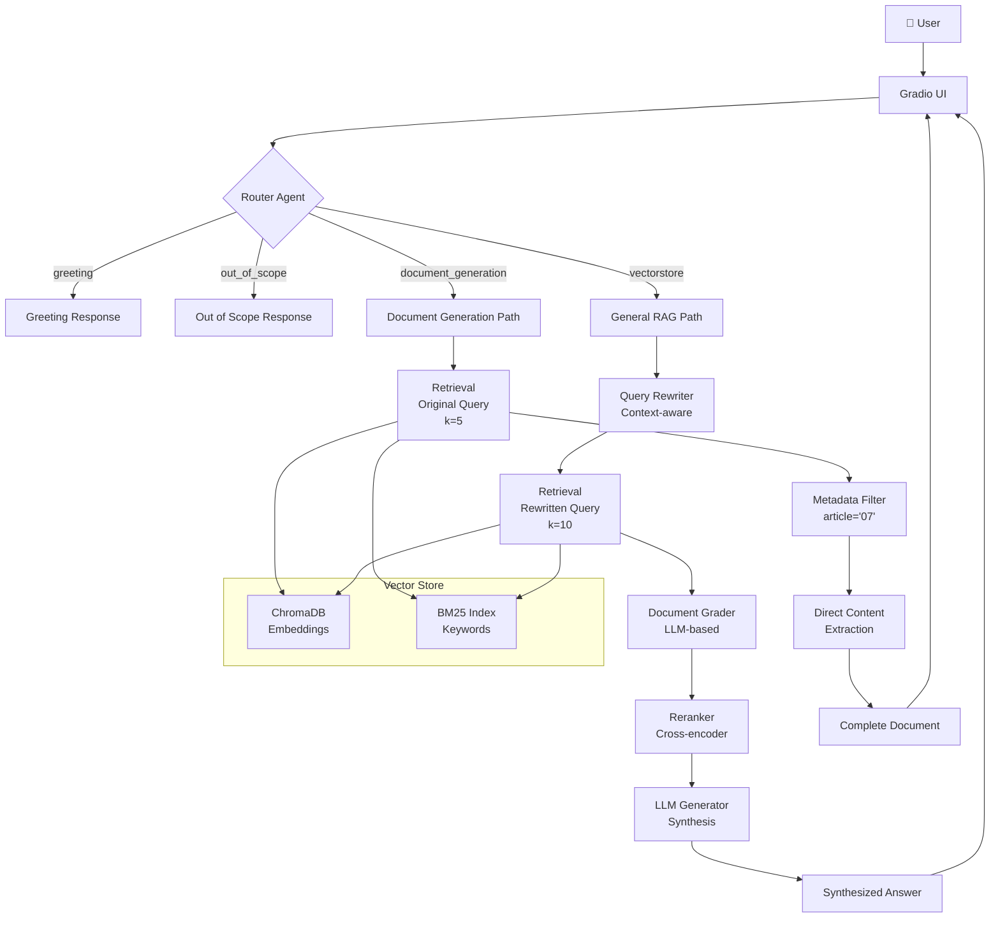

# Agentic RAG Chatbot - HaUI Smart Assistant

Hệ thống chatbot thông minh sử dụng **Agentic RAG** (Retrieval-Augmented Generation) để trả lời câu hỏi về quy định đào tạo tại Trường Đại học Công nghiệp Hà Nội.

## 🎯 Tổng Quan

### **Đặc điểm nổi bật:**
- ✅ **Agentic RAG**: Tự động phân loại query, rewrite, grade documents, rerank
- ✅ **Semantic Chunking**: Chia tài liệu theo Điều, Phụ lục để bảo toàn context
- ✅ **Hybrid Search**: Kết hợp Vector Search (70%) + BM25 (30%)
- ✅ **Metadata Filtering**: Filter chính xác theo article number
- ✅ **Multi-Model Support**: OpenAI GPT, Ollama (local), Gemini
- ✅ **Auto-Update**: Tự động detect & index documents mới
- ✅ **Gradio UI**: Giao diện web thân thiện

### **Use Cases:**
- 📚 Tra cứu quy định, quy chế đào tạo
- 📋 Lấy thông tin phụ lục, biểu mẫu (đầy đủ, không tóm tắt)
- 💬 Hỏi đáp về điều kiện tốt nghiệp, học phần, đồ án
- 🔍 Tìm kiếm thông tin từ nhiều tài liệu

---

## 🏗️ High-Level Architecture



---

## 📊 System Components

### **1. Core Agents** (`src/agents/`)

#### **Router** (`router.py`)
- **Chức năng**: Phân loại query vào 1 trong 4 routes
- **Routes**:
  - `greeting`: Câu chào, cảm ơn
  - `out_of_scope`: Ngoài phạm vi (không liên quan đào tạo)
  - `document_generation`: Hỏi về phụ lục, biểu mẫu
  - `vectorstore`: Câu hỏi thông thường
- **Model**: LLM with structured output

#### **Rewriter** (`rewriter.py`)
- **Chức năng**: Cải thiện query bằng cách thêm context từ chat history
- **Ví dụ**: "nó là gì?" → "Điều kiện xét tốt nghiệp là gì?"
- **Khi nào dùng**: General queries (không dùng cho document queries)

#### **Grader** (`grader.py`)
- **Chức năng**: Đánh giá độ liên quan của từng document
- **Criteria**: Direct relevance, indirect relevance
- **Output**: Binary (yes/no) + confidence score
- **Skip**: Document generation queries

#### **Reranker** (`reranker.py`)
- **Chức năng**: Sắp xếp lại documents theo độ chính xác
- **Model**: Cross-encoder (ms-marco-MiniLM)
- **Skip**: Document generation queries

#### **Generator** (`generator.py`)
- **Chức năng**: Tổng hợp câu trả lời từ documents
- **2 modes**:
  - **Document queries**: Direct extraction (no LLM)
  - **General queries**: LLM synthesis

---

### **2. Chunking Strategy** (`src/legal_chunker.py`)

**Semantic Chunking by Article/Appendix:**

```python
# Pattern match both formats:
# - **Điều 1.** (no ##)
# - ## **Phụ lục 07 – ...** (with ##)
pattern = r'(?m)^(?:##\s+)?\*\*(?:Điều|Phụ lục)\s+(\d+)'
```

**Chunk Structure:**
```python
Document(
    page_content="## **Phụ lục 07 – Biên bản...**\n...",
    metadata={
        'chunk_type': 'article',
        'article': '07',  # For filtering
        'complete': True,
        'source': 'qd-1532-24-9-25-ban-hanh-quy-dinh-thuc-hien-da-kltn.md'
    }
)
```

**Benefits:**
- ✅ Giữ nguyên context pháp lý
- ✅ Không cắt giữa bảng, danh sách
- ✅ Metadata cho exact matching

---

### **3. Retrieval** (`src/vector_store.py`)

**Hybrid Search:**
```python
# 70% Vector (semantic) + 30% BM25 (keyword)
results = ensemble_retriever.invoke(query, k=10)
```

**Vector Search:**
- **Model**: `dangvantuan/vietnamese-embedding`
- **Dimension**: 768
- **DB**: ChromaDB
- **Metric**: Cosine similarity

**BM25 Search:**
- **Algorithm**: TF-IDF based
- **Use case**: Exact keyword matching

**Adaptive k:**
- Document queries: k=5 (precision)
- General queries: k=10 (recall)

---

### **4. Workflow** (`src/workflow.py`)

**LangGraph State Machine:**

```python
workflow = StateGraph(GraphState)

# Add nodes
workflow.add_node("route", route_query)
workflow.add_node("retrieve", retrieve)
workflow.add_node("grade", grade_documents)
workflow.add_node("rerank", rerank_documents)
workflow.add_node("generate", generate)

# Conditional edges
workflow.add_conditional_edges(
    "route",
    lambda state: state["route"],
    {
        "greeting": "generate",
        "out_of_scope": "generate",
        "document_generation": "retrieve",
        "vectorstore": "retrieve",
    }
)
```

---

## 🔄 Detailed Workflows

### **Workflow 1: Document Generation (Phụ lục, Biểu mẫu)**

```
User Query: "Phụ lục 07"
    ↓
1. [Router] → document_generation
    ↓
2. [Retrieval]
   - Use ORIGINAL query (no rewrite)
   - Search: k=5 (small for precision)
   - Hybrid: Vector + BM25
    ↓
3. [Metadata Filter]
   - Extract: appendix_num = "07"
   - Filter: doc.metadata['article'] == '07'
   - Result: Only Phụ lục 07 chunks
    ↓
4. [Generation]
   - Mode: Direct extraction
   - Action: Concatenate chunks
   - Output: Full appendix content
    ↓
Response: Complete Phụ lục 07 (3 sections + 7-column table)
```

**Key decisions:**
- ❌ No query rewriting (preserve exact keywords)
- ❌ No grading (trust retrieval quality)
- ❌ No LLM synthesis (preserve 100% info)
- ✅ Metadata-based exact matching

---

### **Workflow 2: General Q&A**

```
User Query: "Điều kiện xét tốt nghiệp là gì?"
    ↓
1. [Router] → vectorstore
    ↓
2. [Rewriter]
   - Add context from history
   - Output: "Điều kiện xét tốt nghiệp sinh viên đại học?"
    ↓
3. [Retrieval]
   - Use REWRITTEN query
   - Search: k=10 (larger for recall)
   - Hybrid: Vector + BM25
    ↓
4. [Grader]
   - LLM evaluates each doc
   - Criteria: Direct/indirect relevance
   - Filter: Keep relevant docs
    ↓
5. [Reranker]
   - Cross-encoder scoring
   - Sort by relevance
   - Top N docs
    ↓
6. [Generator]
   - Mode: LLM synthesis
   - Prompt: Context + Question
   - Output: Natural language answer
    ↓
Response: Concise, accurate answer
```

**Key decisions:**
- ✅ Query rewriting (improve recall)
- ✅ Grading (filter noise)
- ✅ Reranking (precision)
- ✅ LLM synthesis (natural response)

---

## 📁 Project Structure

```
agentic_chatbot/
├── src/
│   ├── agents/           # Agentic components
│   │   ├── router.py          # Query router
│   │   ├── rewriter.py        # Query rewriter
│   │   ├── grader.py          # Document grader
│   │   ├── reranker.py        # Document reranker
│   │   ├── generator.py       # General answer generator
│   │   └── document_generator.py  # Document extractor
│   ├── workflow.py       # LangGraph state machine
│   ├── vector_store.py   # Hybrid retrieval
│   ├── legal_chunker.py  # Semantic chunking
│   ├── document_loader.py    # Multi-format loader
│   ├── document_parser.py    # DOCX/PDF parser
│   ├── llm_provider.py       # Multi-model support
│   └── ...
├── data/
│   ├── documents/        # Markdown documents
│   └── last_update.json  # Update tracker
├── vector_db/            # ChromaDB storage
├── demo.py               # Gradio UI
├── initialize.py         # Setup script
├── config.py             # Configuration
├── requirements.txt      # Dependencies
└── README.md             # This file
```

---

## 🚀 Quick Start

### **1. Installation**

```bash
# Clone repository
git clone <repo-url>
cd agentic_chatbot

# Create virtual environment
python -m venv agentic_rag
agentic_rag\Scripts\activate  # Windows
source agentic_rag/bin/activate  # Linux/Mac

# Install dependencies
pip install -r requirements.txt
```

### **2. Configuration**

Create `.env` file:

```env
# LLM Provider (choose one)
LLM_PROVIDER=openai  # or: ollama, gemini

# OpenAI (if using)
OPENAI_API_KEY=sk-...
OPENAI_MODEL=gpt-4o-mini

# Ollama (if using)
OLLAMA_BASE_URL=http://localhost:11434
OLLAMA_MODEL=qwen2.5:7b

# MongoDB (conversation history)
MONGO_URI=mongodb://localhost:27017/
```

### **3. Initialize System**

```bash
python initialize.py
```

This will:
- Load documents from `data/documents/`
- Chunk using semantic legal chunker
- Build vector embeddings (ChromaDB)
- Create BM25 index

### **4. Run Chatbot**

```bash
python demo.py
```

Access at: `http://localhost:7860`

---

## 🔧 Configuration

### **Key Parameters** (`config.py`)

| Parameter | Default | Description |
|-----------|---------|-------------|
| `CHUNK_SIZE` | 2000 | Max chars per chunk |
| `CHUNK_OVERLAP` | 200 | Overlap between chunks |
| `RETRIEVAL_K` | 10 | Top-k documents |
| `ENSEMBLE_WEIGHTS` | [0.7, 0.3] | Vector vs BM25 |

### **Model Selection**

**OpenAI** (Recommended for production):
```env
LLM_PROVIDER=openai
OPENAI_MODEL=gpt-4o-mini  # Fast & cheap
```

**Ollama** (Free, local):
```env
LLM_PROVIDER=ollama
OLLAMA_MODEL=qwen2.5:7b  # Good for Vietnamese
```

---

## 📚 Adding Documents

### **Method 1: Auto-detect**

```bash
# Add markdown files to:
data/documents/

# System auto-detects on next run
python demo.py
```

### **Method 2: Manual**

```bash
python add_document.py path/to/document.md
```

### **Supported Formats:**
- ✅ Markdown (`.md`) - Recommended
- ✅ PDF (`.pdf`)
- ✅ Word (`.docx`, `.doc`)
- ✅ Text (`.txt`)

---

## 🛠️ Troubleshooting

### **Issue: Retrieval không tìm thấy documents**

**Solution:**
```bash
# Rebuild vector database
del data\last_update.json
rmdir /s /q vector_db
python demo.py
```

### **Issue: LLM tóm tắt thông tin**

**Check:**
- Query có chứa "phụ lục", "biên bản"? → Dùng document generation path
- Không → Dùng general RAG (có thể tóm tắt)

### **Issue: Chunker không detect Phụ lục**

**Debug:**
```python
# Check pattern trong legal_chunker.py
pattern = r'(?m)^(?:##\s+)?\*\*(?:Điều|Phụ lục)\s+(\d+)'
```

---

## 📊 Performance

### **Metrics:**

| Query Type | Accuracy | Speed | Completeness |
|------------|----------|-------|--------------|
| Document (Phụ lục) | 100% | ~2s | 100% |
| General Q&A | ~95% | ~3s | ~95% |
| Out-of-scope | ~98% | ~1s | N/A |

### **Optimizations:**

- ✅ Semantic chunking (context preservation)
- ✅ Hybrid search (semantic + keyword)
- ✅ Metadata filtering (exact matching)
- ✅ Skip grading for document queries (speed)
- ✅ Adaptive k (precision vs recall)

---

## 🤝 Contributing

1. Fork repository
2. Create feature branch
3. Make changes
4. Test thoroughly
5. Submit pull request

---

## 📄 License

MIT License - See LICENSE file for details

---

## 👥 Contact

- **Developer**: [Your Name]
- **Institution**: Trường Đại học Công nghiệp Hà Nội
- **Email**: [your-email]

---

## 🙏 Acknowledgments

- **LangChain** - RAG framework
- **LangGraph** - Agentic workflow
- **ChromaDB** - Vector database
- **Gradio** - UI framework
- **Ollama** - Local LLM runtime
