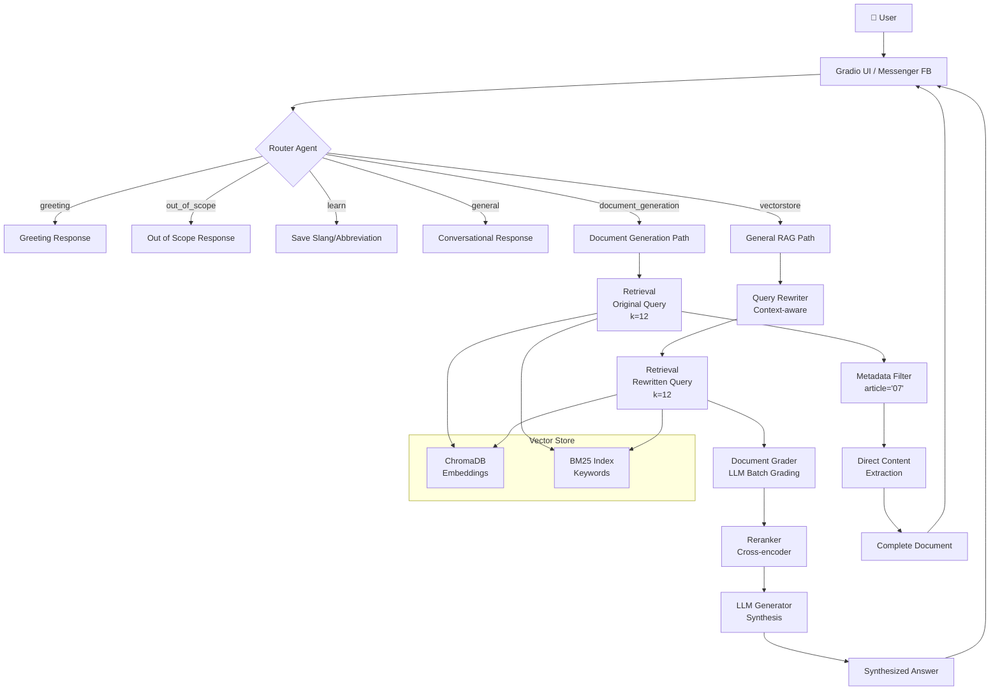

# Agentic RAG Chatbot - HaUI Smart Assistant

Hệ thống chatbot thông minh sử dụng **Agentic RAG** (Retrieval-Augmented Generation) để trả lời câu hỏi về quy định đào tạo tại Trường Đại học Công nghiệp Hà Nội.

## 🎯 Tổng Quan

### **Đặc điểm nổi bật:**
- ✅ **Agentic RAG**: Tự động phân loại query, rewrite, grade documents, rerank
- ✅ **Semantic Chunking**: Chia tài liệu theo Điều, Phụ lục để bảo toàn context
- ✅ **Hybrid Search**: Kết hợp Vector Search (50%) + BM25 (50%)
- ✅ **Metadata Filtering**: Filter chính xác theo article number hoặc thông qua intent injection
- ✅ **Multi-Model Support**: Gemini, OpenAI, Groq, OpenRouter, Ollama (local)
- ✅ **Auto-Update**: Tự động detect & index documents mới bằng hệ thống Tracker MD5
- ✅ **Deployment**: Giao diện Gradio thân thiện và Backend hỗ trợ webhook Facebook Messenger

### **Use Cases:**
- 📚 Tra cứu quy định, quy chế đào tạo
- 📋 Lấy thông tin phụ lục, biểu mẫu (đầy đủ, không tóm tắt)
- 💬 Hỏi đáp về điều kiện tốt nghiệp, học phần, đồ án
- 🔍 Tìm kiếm thông tin từ nhiều tài liệu
- 🤖 Hỗ trợ học thuật ngữ sinh viên (tự lưu cấu trúc viết tắt/slang mới)

---

## 🏗️ High-Level Architecture



---

## 📊 System Components

### **1. Core Agents** (`src/agents/`)

#### **Router** (`router.py`)
- **Chức năng**: Phân loại query vào 1 trong 6 routes
- **Routes**:
  - `greeting`: Câu chào hỏi đơn giản
  - `out_of_scope`: Câu hỏi nằm ngoài đời sống sinh viên HaUI
  - `learn`: Học và ghi nhớ các quy tắc viết tắt mới từ ngữ cảnh
  - `general`: Hội thoại phiếm hoặc truy vấn lịch sử cuộc trò chuyện
  - `document_generation`: Hỏi đáp yêu cầu xuất phụ lục cụ thể
  - `vectorstore`: RAG thông thường cho mọi quy chế, quy định

#### **Rewriter** (`rewriter.py`)
- **Chức năng**: Cải thiện query, phân tách câu hỏi đa phức hợp và bổ sung context
- **Ví dụ**: "nó là gì?" → "Điều kiện xét tốt nghiệp là gì?"
- **Khi nào dùng**: General queries (bị vô hiệu hóa với document queries)

#### **Grader** (`grader.py`)
- **Chức năng**: Đánh giá độ liên quan của từng document được nạp.
- **Tính năng**: Chạy the Batch LLM Grading giúp tiết kiệm tokens
- **Output**: Chỉ số các index phù hợp hoặc rơi vào fallback top 1
- **Skip**: Document generation queries (vì đã có filter metadata)

#### **Reranker** (`reranker.py`)
- **Chức năng**: Sắp xếp lại documents theo độ chính xác từ chuyên gia văn bản
- **Model**: LLM-based với prompt chi tiết
- **Skip**: Bỏ qua nếu Grader cảnh báo mức độ relevance thấp hoặc đi vào fallback

#### **Generator** (`generator.py`)
- **Chức năng**: Tổng hợp câu trả lời từ documents đáp ứng rule HaUI
- **Bảo mật RAG**: Cơ chế xử lý thời khóa biểu gắt gao, chống bù đắp (hallucination)

---

### **2. Chunking Strategy** (`src/legal_chunker.py`)

**Semantic Chunking by Article/Appendix:**

Hệ thống có regex phức tạp giúp bắt chính xác "Điều" hoặc "Phụ lục":
```python
pattern = r'^(?:#{1,3}\s+)?(?:\*\*)?(?:Điều|Phụ lục|Slide)\s+(\d+)'
```

**Chunk Structure:**
```python
Document(
    page_content="## **Phụ lục 07 – Biên bản...**\n...",
    metadata={
        'chunk_type': 'article',
        'article': '07',  # For filtering
        'chapter': 'Chương II: ...',
        'complete': True,
        'source': 'qd-1532-24-9-25.md'
    }
)
```

---

### **3. Retrieval** (`src/vector_store.py`)

**Hybrid Search:**
```python
# 50% Vector (semantic) + 50% BM25 (keyword)
results = ensemble_retriever.invoke(query, k=12)
```

**Adaptive Control:**
- Sử dụng cấu hình mặc định (RETRIEVAL_K = 12) cho toàn bộ truy vấn.
- Thêm Intent Injection nhúng code cứng để bootstrap trả bài vào top 1 đối với các key query như học bổng, vị trí phòng ban (VD: SEEE).

---

### **4. Workflow** (`src/workflow.py`)

**Hệ thống xử lý tuần tự (Agentic Workflow):**

Khác với các project gốc từ LangGraph, hệ thống này được thiết kế procedural 100% qua python thuần bằng luồng điều kiện (if/elif) nhằm mục đích control mượt luồng Agent:

```python
def run(self, question: str, session_id: str = None, chat_history: list = None):
    # 1. Phân loại truy vấn
    route = self.router.route(question, history)
    
    # Các kịch bản rẽ nhánh không qua RAG (Tối ưu độ trễ)
    if route == "greeting": return [...]
    elif route == "out_of_scope": return [...]
    elif route == "learn": return [...]
    elif route == "general": return [...]
    
    # 2. Truy xuất
    documents = self.retrieve(state)
    
    # 3. Phân mức & Rerank (Skip hoàn toàn LLM overhead nếu mục đích chỉ lấy nội dung Biểu mẫu)
    if not is_document_query:
        documents = self.grade_documents(state)
        documents = self.rerank_documents(state)
        
    # 4. Tạo kết quả & Auto-Retry
    while retry_count <= MAX_RETRIES:
        answer = self.generate_answer(state)
        if ENABLE_HALLUCINATION_CHECK and self.check_hallucination(answer):
            break
```

---

## 📁 Project Structure

```
agentic_chatbot/
├── src/
│   ├── agents/           # Thành phần Agent thông minh
│   │   ├── router.py          # Query router
│   │   ├── rewriter.py        # Query rewriter
│   │   ├── grader.py          # Document grader
│   │   ├── reranker.py        # Document reranker
│   │   ├── generator.py       # Answer generator chung
│   │   ├── document_generator.py # Trích xuất thông tin form/phụ lục
│   │   └── hallucination_check.py # Kiểm tra ảo giác LLM
│   ├── workflow.py       # Module cấu hình Workflow
│   ├── vector_store.py   # Quản lý Hybrid retrieval (Chroma + BM25)
│   ├── legal_chunker.py  # Thuật toán cắt luật pháp Việt Nam
│   ├── document_loader.py# Multi-format index loader
│   ├── llm_provider.py   # Wrap LLM Auto-Retry + Fallback
│   └── slang_manager.py  # Quản lý Data từ viết tắt
├── data/
│   ├── documents/        # File tài liệu Markdown
│   └── last_update.json  # Hash tracker để Update file System
├── vector_db/            # Vector Database Lưu trữ cục bộ
├── core/
│   ├── initialize.py     # Setup script nạp Embeddings (Chạy đầu tiên)
│   └── config.py         # File load cấu hình tập trung
├── demo.py               # Giao diện kiểm thử hệ thống (Gradio UI)
├── server.py             # Máy chủ Deploy ứng dụng Facebook Messenger
├── requirements.txt      # Module Dependencies
└── README.md             # This file
```

---

## 🚀 Quick Start

### **1. Installation**

```bash
# Clone repository
git clone <repo-url>
cd agentic_chatbot

# Create virtual environment
python -m venv agentic_rag
agentic_rag\Scripts\activate  # Windows
source agentic_rag/bin/activate  # Linux/Mac

# Install dependencies
pip install -r requirements.txt
```

### **2. Configuration**

Khởi tạo cấu hình qua file `.env`:

```env
# Chọn Model qua cờ kích hoạt (Boolean)
USE_GEMINI=true
USE_GROQ=false
USE_OLLAMA=false
USE_OPENROUTER=false

# Gemini setup (Recommended cho Production)
GEMINI_API_KEY=AIzaSy...
GEMINI_MODEL=gemini-2.0-flash

# Hoặc thiết lập sử dụng Ollama:
OLLAMA_BASE_URL=http://localhost:11434
OLLAMA_MODEL=qwen2.5:7b

# Cấu hình CSDL hội thoại (MongoDB cho Session Chat)
MONGODB_URI=mongodb://localhost:27017/
MONGODB_DATABASE=agentic_rag_db
```

### **3. Initialize System**

Nạp Embedding và Chunk Dữ liệu vào Database. **Chạy qua core module**:

```bash
python core/initialize.py
```

Lệnh này sẽ làm các việc sau:
- Khởi chạy load các file từ `data/documents/`
- Chạy module semantic chunker cho nội dung
- Embed và lưu nội dung vào Vector DB
- Kéo từ khoá để làm index cho BM25

### **4. Run Chatbot**

**Mode 1: Giao diện web Gradio (Developer Test)**
```bash
python demo.py
```
Truy cập tại giao diện: `http://localhost:7860`

**Mode 2: FastAPI Webhook Backend (Production)**
```bash
python server.py
# Server sẽ lắng nghe ở Port 10000 cho nền tảng nhắn tin
```

---

## 🔧 Configuration Parameters (`core/config.py`)

| Parameter | Default | Description |
|-----------|---------|-------------|
| `CHUNK_SIZE` | 2000 | Baseline ký tự tối đa / 1 cụm. |
| `CHUNK_OVERLAP` | 200 | Số lượng ký tự chồng chéo. |
| `RETRIEVAL_K` | 12 | Tổng số văn bản kéo từ DB mỗi query. |
| `ENSEMBLE_WEIGHTS` | [0.5, 0.5] | Trọng số Hybrid: Chroma(Vector) - Langchain BM25. |

---

## 📚 Adding Documents

### **Auto-detect thông qua Watcher**

```bash
# Thực hiện việc quăng File vô thư mục:
data/documents/

# Chạy lệnh UI hoặc webhook đều sẽ tự phát hiện file mới thông qua tracker.json
python demo.py
```

### **Supported Formats:**
- ✅ Markdown (`.md`) - Tối ưu nhất để tận dụng Regex Article parsing
- ✅ PDF (`.pdf`)
- ✅ Word (`.docx`, `.doc`)
- ✅ Text (`.txt`)

---

## 🤝 Contributing

1. Fork repository
2. Create feature branch
3. Make changes
4. Test thoroughly bằng Gradio
5. Submit pull request

---

## 📄 License
MIT License - See LICENSE file for details

---

## 👥 Contact
- **Institution**: Trường Đại học Công nghiệp Hà Nội Trang Sinh Viên
